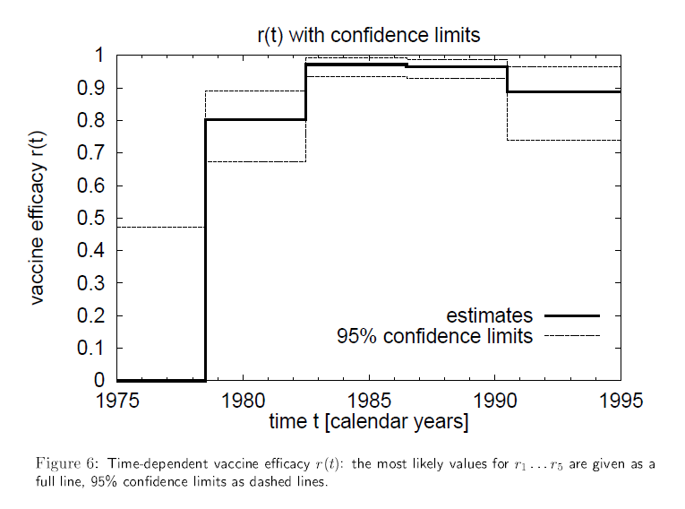

```{r, message=FALSE, warning=FALSE, include=FALSE}
library(RcmdrMisc)
library(multcomp)
```

## Introduction

In this exercise, a dataset was used in order to get practice with calculating risk and odds ratios. These data were also used to examine vaccine efficacy.  

## Method

The data for these questions were provided by the exercise prompt for the course, which were in turn obtained from Reference 1 (Eichner, 2001).

The data were organized and analyzed completely in `R`. The course literature referred to methods in Excel and other third-party tools, but I selected to do everything in `R` since third-party tools may not be open-source or stable in the future.  

### Loading the data

#### Instructions:  
Use Year, Vaccine Coverage%, n, and observed number of cases for both unvaccinated and vaccinated.  

```{r loadData, message=FALSE, warning=FALSE, include=FALSE}
# Rather than using Excel, I used VS Code to set up the data for direct import into a dataframe
library(tidyverse)
measles <- data.frame(
    Year = c(
        1973:1986
    )
    , pCentCvg = c(
        45.1, 27.6, 42.4, 35.7, 43.7, 54.2, 67.7, 66.8, 72.6, 74.3, 73.7, 79.6, 83.7, 85.0
    )
    , n = c(1253, 1509, 1548, 1690, 1747, 1871, 1810, 1903, 2027, 2020, 2076, 2081, 2089, 2147)
    , obsUnvac = c(3, 3, 9, 7, 20, 22, 17, 17, 22, 24, 15, 18, 20, 16)
    , obsVac = c(2, 2, 7, 3, 5, 6, 7, 4, 3, 4, 6, 7, 6, 7)
) %>% as_tibble()
```


#### Instructions:  
Using vaccine coverage and n, you should be able to calculate the total number of individuals in each group; unvaccinated and vaccinated for all cohorts.  
```{r featureEngineering}
measles %<>% 
    mutate(
        nVac = round(n * (pCentCvg / 100), 0)
        , nUnvac = n - nVac)
measles
```


#### Instructions:  
Calculate the risk for contracting measles for both groups for all cohorts.  

```{r calcRisk}
measles %<>%
    mutate(riskVac = obsVac / nVac
           , riskUnvac = obsUnvac / nUnvac)
measles
```

#### Instructions:  
Calculate the odds.  

```{r calcOdds}
measles %<>%
    mutate(oddsVac = riskVac / (1 - riskVac)
           , oddsUnvac = riskUnvac / (1 - riskUnvac))
measles
```

#### Instructions:  
Calculate the risk ratio (RR) and odds ratio (OR) for all cohorts.  
```{r calcRiskRatio}
measles %<>%
    mutate(riskRatio = riskVac / riskUnvac)
measles
```

#### Instructions:  
Calculate the vaccine efficacy for all cohorts.  
```{r calcVacEff}
measles %<>%
    mutate(vacEff = 1 - riskRatio)
measles
```

#### Instructions:  
Perform a Chi2-test for the risk estimations for each cohort by analyzing 2x2-tables. Apply the Chi2 statistics when appropriate other wise use Fisher’s exact test.  

```{r chiSq}
measles %<>%
    mutate(healthyUnvac = nUnvac - obsUnvac
           , healthyVac = nVac - obsVac)
measles


for (row in seq(nrow(measles))) {
    year <- measles$Year[row]
    tmpMatrix <-
        measles %>%
            select(obsVac, healthyVac, obsUnvac, healthyUnvac) %>%
            .[row, ] %>%
            unlist() %>% 
            matrix(., 2, 2, byrow = TRUE)
    
    dimnames(tmpMatrix) <-
        list("Vaccination status"=c("1", "2"), "Disease Status"=c("1", "2"))
    
        assign(paste0('contingencyTableFor', year), tmpMatrix
               , envir = parent.frame())
    
    cat('\n\nFisher test for ', year, ':\n')
    print(fisher.test(tmpMatrix))
        
    rm(tmpMatrix)

}
```

I used a Fisher's exact test for all years instead of Chi-square. The Fisher's exact test outperforms Chi-square when there are few samples (Reference 2 and Reference 3). When there are large sample sizes, chi-square accuracy approaches that obtained by Fisher's exact, with the only downside I've understood for Fisher's exact being the requirement for additional computational power. Since I am performed the calculations in `R` and not manually, and because the sample sizes range from fewer than 10 per cell to a few hundred, I decided to use Fisher's exact test in all cases. Using a single testing strategy also enabled me to write a simplified loop in order to do the test for all cohorts (years) in the dataset.  

#### Instructions:  
Indicate for each year if the risk ratio is significantly different from one, and hence, if vaccine efficacy is significantly larger than zero.  

#### Answer:  
As per the results of the Fisher's exact tests, the vaccine was effective (the risk ratio was significantly lower than 1) for all years between 1977 and 1986.  

#### Instructions:  
Make a graph showing how vaccine efficacy changes over time.  

```{r plot, fig.cap='Figure 1: Measles Vaccine Efficacy over time in Germany'}
library(scales)
measles %>% 
    mutate(adjEff = case_when(Year < 1977 ~ 0
                              , TRUE ~ vacEff)) %>% 
    ggplot(aes(x = Year, y = adjEff)) +
    geom_line() +
    scale_y_continuous(labels = percent_format(scale = 100)) +
    labs(y = 'Vaccine Efficacy')
```
#### Instructions:  
Does your graph resemble the result from the original paper?


##### Answer:  
My graph somewhat resembles that from the paper. In the paper, they show a step-wise function, but the similarity is that there is very little efficacy observeduntil 1977, when efficacy climbs to over 70% and remains elevated through the end of the observation period.  



#### Instructions:  
Next step is to look at the differences among years and see if can say that the change between two years is significant. One way of doing this is by comparing the risk ratios by estimating confidence intervals for each year’s RR. Make calculations for all years and compare RR and their CI with each other. If the CI for an RR does not overlap the RR for another year, then the two RR values can be regarded as significantly different. Make comparisons between all adjacent years.  

The course literature referred to a site where one can manually enter data into 2X2 contingency tables to find confidence intervals for risk ratios, but this seemed rather inefficient if one has many datasets to compare. Thus, I did some internet digging to figure out how to calculate the confidence interval myself and do the same work programmatically. I found a discussion on Stack Exchange (Reference 4) that gave a formula for calculating the standard error of a risk ratio, as well as how to use this to derive the 95% confidence interval. I confirmed that my values matched the reference provided by the course literature (Reference 5).  

```{r rrCI}
measles %<>% 
    mutate(
        seRiskRatio = sqrt((1 / obsVac) - (1 / (nVac)) +  (1 / obsUnvac) - (1 / (nUnvac)))
        , riskRatioLoCI = exp(log(riskRatio) - 1.96 * seRiskRatio)
        , riskRatioHiCI = exp(log(riskRatio) + 1.96 * seRiskRatio)
    )

measles
```

#### Instructions:  
Are there any significant shifts in vaccination efficacy over time?  

```{r plotWithCI, fig.cap='Figure 3: 95% Confidence Intervals for the Risk Ratio Over Time'}
measles %>% 
    select(Year, riskRatioLoCI, riskRatioHiCI) %>% 
    mutate(rr1 = 1) %>% 
    pivot_longer(cols = c(riskRatioLoCI, riskRatioHiCI, rr1)) %>% 
        ggplot(aes(x = Year, y = value, color = name)) +
        geom_line() +
        labs(y = '95% Confidence Interval for Risk Ratio')

```

##### Answer:  

There was never a two-year period where the confidence intervals did not overlap. Even in the year with the greatest improvement in vaccine efficacy (and reduction in risk ratio for those who were vaccinated), the 95% CI for the risk ratio in 1976 was 0.20--2.98 and in 1977 it was 0.12--0.86.  

#### Instructions:  
Once you have both the RR and its CI you will also be able to calculate CI for each value of vaccine efficacy. You can then produce a graph with both vaccine efficacy and its CI if you add two columns one for +CL for vaccine efficacy (Confidence Limit) and one for -CL for vaccine efficacy.  

```{r vacEffCI, fig.cap='Figure 4: 95% Confidence Intervals for the Vaccine Efficacy Over Time'}
measles %<>% 
    mutate(
        vacEffLoCI = 1 - riskRatioHiCI
        , vacEffHiCI = 1 - riskRatioLoCI
    )

measles

measles %>% 
    select(Year, vacEff, vacEffLoCI, vacEffHiCI) %>% 
    mutate(rr1 = 1) %>% 
    pivot_longer(cols = c(vacEff, vacEffLoCI, vacEffHiCI)) %>% 
    mutate(value = case_when(value < 0 ~ 0, TRUE ~ value)) %>% 
        ggplot(aes(x = Year, y = value, color = name)) +
        geom_line() +
        labs(y = 'Vaccine Efficacy +/- the 95% Confidence Interval') +
        scale_y_continuous(labels = percent_format(scale = 100)) +
    theme(legend.position = 'none')
```


## Discussion

The measles vaccine did not show efficacy in the first couple of years, however these years were characterized by low incidence of measles cases in the cohorts studied. From year 1977 onwards, however, there was a demonstrable (i.e., statistically significant) effect of the measles vaccine in reducing the risk of developing measles. The risk ratio for developing ratio remained low throughout the rest of the study period.  


## References

1.  Eichner, Martin. Estimation of the time-dependent vaccine efficacy from a measles epidemic. Statistics in Medicine (2001).
2. [Fisher's or chi-square test?](https://www.graphpad.com/guides/prism/latest/statistics/stat_chi-square_or_fishers_test.htm)
3. [Educational Research Column: Choosing Wisely: Chi-Square vs. Fisher's Exact](https://www.saem.org/about-saem/academies-interest-groups-affiliates2/cdem/for-students/cdem-voice/educational-research-column/educational-research-column-choosing-wisely-chi-square-vs.-fisher-s-exact)
4. [Stack Exchange: Formula for standard error of Risk Ratios and calculationg 95% Confidence Intervals](https://stats.stackexchange.com/questions/126727/why-doesnt-standard-error-for-ratios-have-log-in-it)
5. [Open Epi 2X2 Table Statistics](http://www.openepi.com/TwobyTwo/TwobyTwo.htm)
